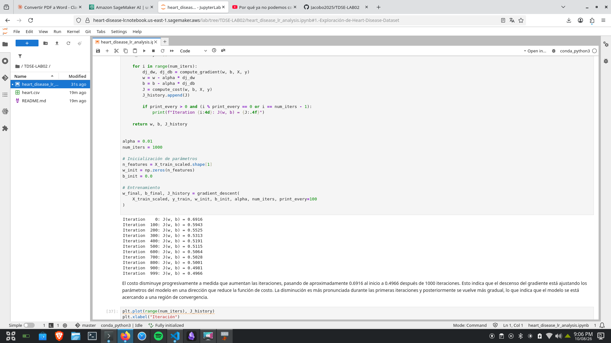
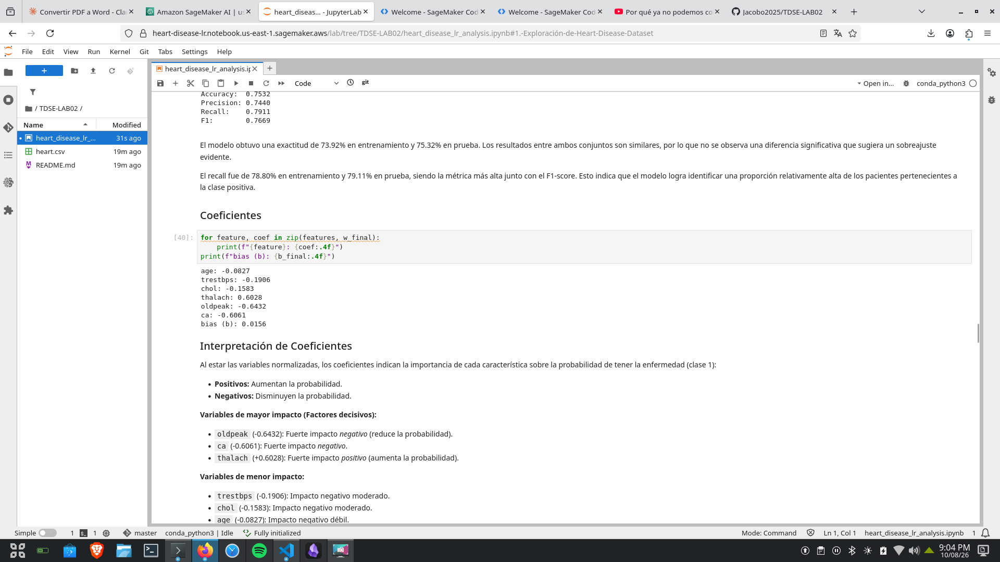
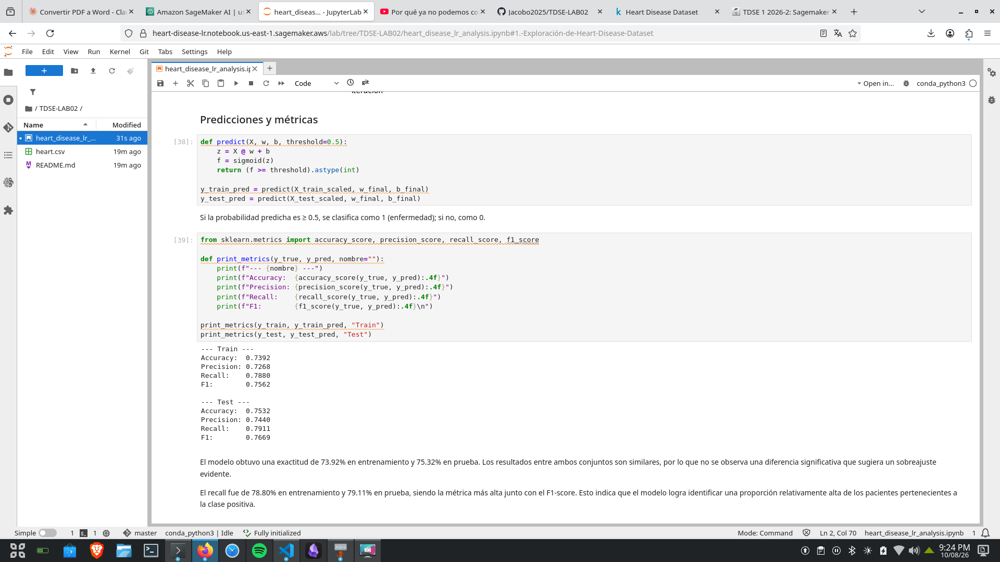

# Heart Disease Risk Prediction — Logistic Regression

## Autor

Jacobo Díaz — TDSE-LAB02

## Resumen

Este proyecto implementa regresión logística desde cero (sin scikit-learn para el modelo) para predecir enfermedad cardíaca a partir de datos clínicos. Incluye análisis exploratorio, entrenamiento, visualización de fronteras de decisión, regularización L2, y entrenamiento/prueba en Amazon SageMaker.

## Dataset

Heart Disease Dataset (Kaggle): https://www.kaggle.com/datasets/neurocipher/heartdisease

Features usadas: `age`, `trestbps`, `chol`, `thalach`, `oldpeak`, `ca`.

## Resultados

| Métrica | Test |
|---|---|
| Accuracy | 0.7532 |
| Precision | 0.7440 |
| Recall | 0.7911 |
| F1 | 0.7669 |

## Evidencia de SageMaker

**Entorno:** Notebook instance de Amazon SageMaker, kernel `conda_python3`.

El modelo se entrenó y probó dentro de un notebook de Amazon SageMaker (AWS Academy). Solo se usó para entrenamiento y prueba — no se creó ni desplegó ningún endpoint. Los resultados fueron consistentes con la ejecución local.

**Entrenamiento:**

**Coeficientes:**

**Predicciones y métricas:**
